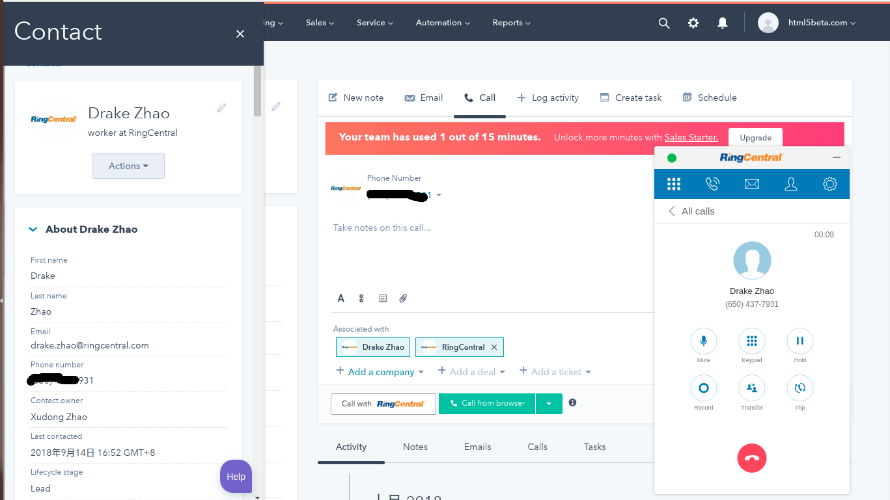
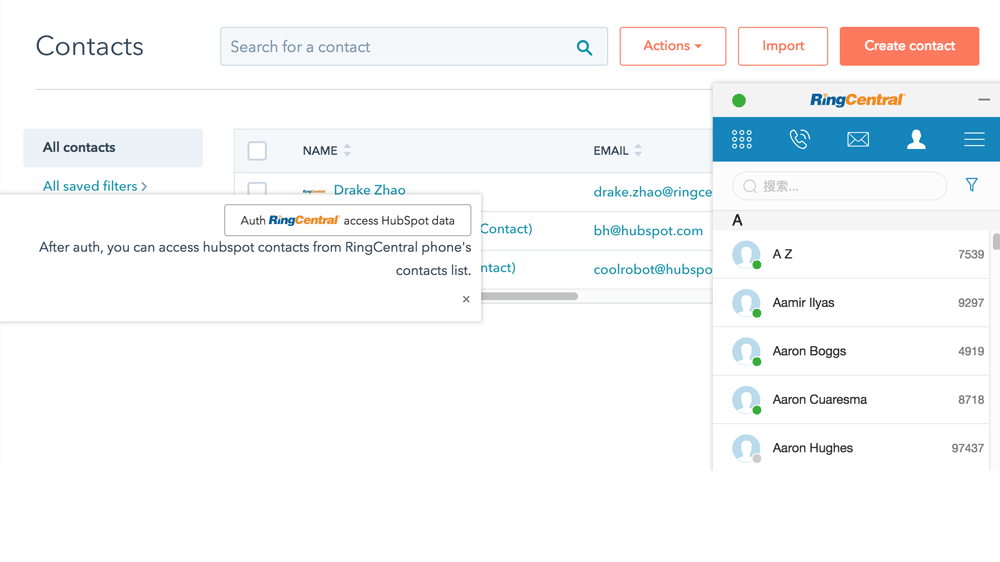
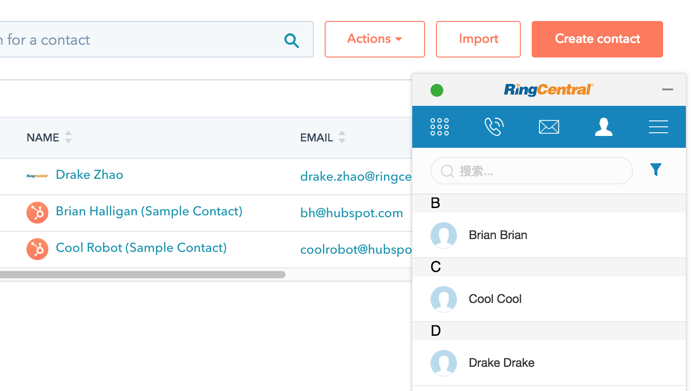
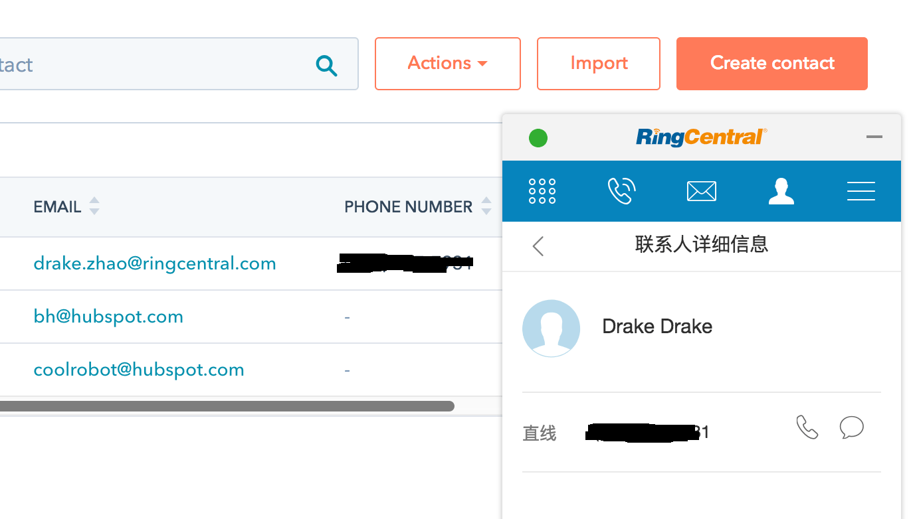

# RingCentral Embeddable Voice for HubSpot(chrome extension)
Add RingCentral Embeddable Voice widgets to hubspot contacts list and call contact page with chrome extension.

Created with [Embbnux Ji](https://github.com/embbnux)'s tuturial:
 [Building Chrome Extension Integrations with RingCentral Embeddable](https://medium.com/ringcentral-developers/build-a-chrome-extension-with-ringcentral-embeddable-bb6faee808a3)

| preview            |  preview |
:-------------------------:|:-------------------------:
 | 
 | 
 | 
 | 


## Features
- Click to call button
- Popup when call inbound
- build with custom app config

## Build and Use

1. build `content.js`
```bash
git clone https://github.com/zxdong262/hubspot-embeddable-ringcentral-phone.git
cd hubspot-embeddable-ringcentral-phone
npm i

# build content.js first, with webpack
# edit src/*.js, webpack will auto-rebuild
npm start

```

2. Go to Chrome extensions page.
3. Open developer mode
4. Load `hubspot-embeddable-ringcentral-phone/dist` as unpacked package.
5. Go to `https://app.hubspot.com` to check

## Build with custom appKey/appServer etc
```bash
cp config.sample.js config.js
```

Then edit config.js
```js
  // hubspot app client ID,
  // get it from your hubspot app, https://app.hubspot.com/developer
  // appKeyHS: ,

  // hubspot app client Secret,
  // appSecretHS: ,

  // hubspot app auth server
  // appServerHS: ,

  // hubspot app api server
  // apiServerHS: ,

  // hubspot app redirect uri
  // appRedirectHS: ,

  // your ringcentral app's Client ID
  // get them from https://developer.ringcentral.com
  // appKey: ,

  // your ringcentral app's Auth Server URL
  // appServer:

  // minimize content.js
  // minimize: false
```

## License
MIT

