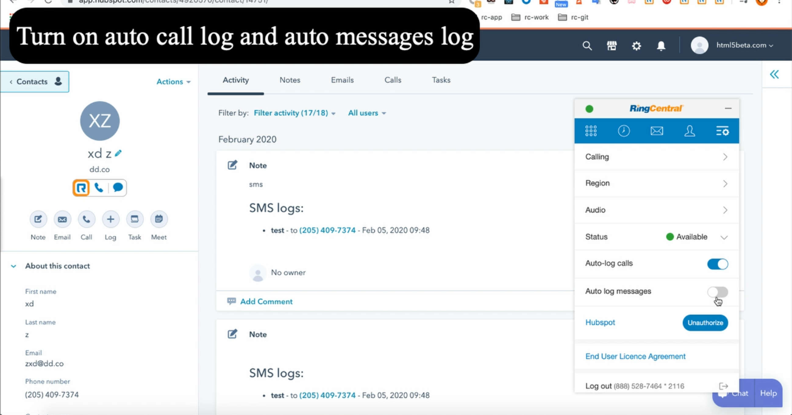
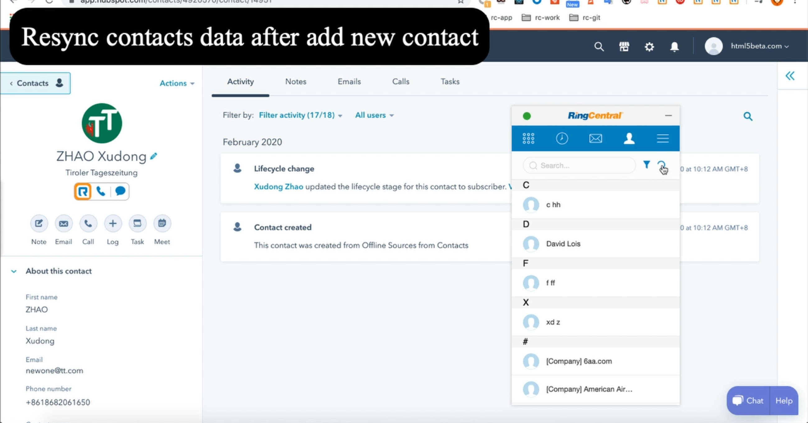
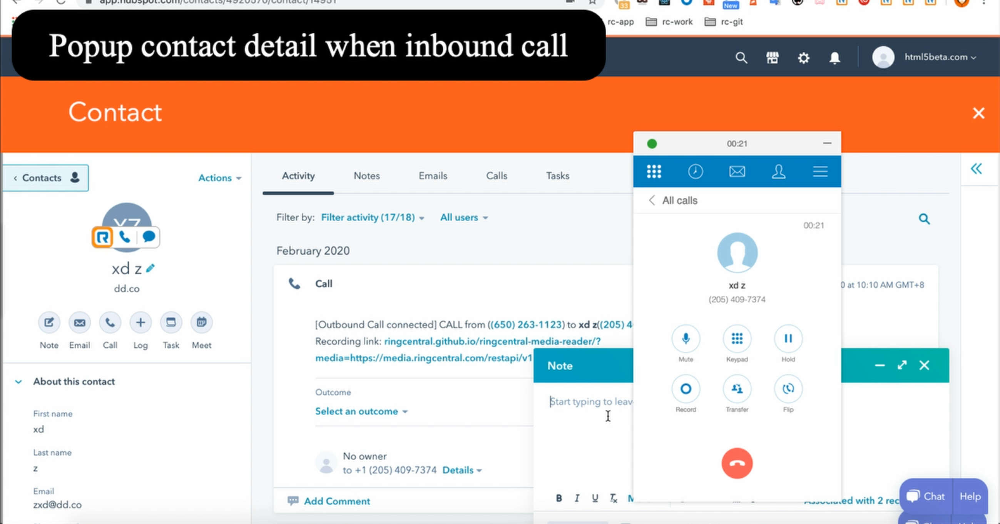

# RingCentral Embeddable for HubSpot (Chrome extension) <!-- omit in toc -->

Add [RingCentral Embeddable Voice widgets](https://github.com/ringcentral/ringcentral-embeddable) to HubSpot contacts list and call contact page with Chrome extension.

Created with [ringcentral-embeddable-extension-factory](https://github.com/ringcentral/ringcentral-embeddable-extension-factory), you could create similar extension for other CRM sites.

## Table of contents <!-- omit in toc -->

- [Youtube video](#youtube-video)
- [Screenshots](#screenshots)
- [Features](#features)
- [Try it](#try-it)
- [Custom build and use](#custom-build-and-use)
- [Build with custom RingCentral clientID/appServer](#build-with-custom-ringcentral-clientidappserver)
- [Credits](#credits)
- [License](#license)

## Youtube video

[https://youtu.be/OpXYHIGISaI](https://youtu.be/OpXYHIGISaI)

## Screenshots

| screenshots            |  screenshots |
:-------------------------:|:-------------------------:
 | 
 | 
 | 
 | 
 | 

## Features

- Click to call button
- Popup callee info panel when call inbound
- Build with custom app config
- Auto/manually sync call log/voicemail/sms to hubspot, [About auto call log sync feature](https://github.com/ringcentral/hubspot-embeddable-ringcentral-phone/issues/137).
- Check hubspot activities from ringcentral contact panel
- Custom X-USER-AGENT header for api request
- Active call control
- Sync call log to deal
- Call log with call recording link
- Call from deal page
- Insert meeting content to HubSpot or sync meeting info to HubSpot
- Click to open schedule meeting page.
- Support RingCentral Video

## Try it

- Download the zip from release page: [https://github.com/ringcentral/hubspot-embeddable-ringcentral-phone/releases](https://github.com/ringcentral/hubspot-embeddable-ringcentral-phone/releases)
- Unpack it, get a dist folder, open your Chrome extension page(chrome://extensions/), make sure you **enable the developer mode**, click load unpacked, select the dist folder, for Firefox extnesion, choose Addon -> Enable add-on debugging -> Load Temporary Add-on -> Choose dist-firefox/menifest.json.
- Go to `https://app.hubspot.com` to check
- Make sure you ***turn off*** `Block third-party cookies` in `chrome://settings/content/cookies`

## Custom build and use

1. build `content.js`

```bash
git clone https://github.com/ringcentral/hubspot-embeddable-ringcentral-phone.git
cd hubspot-embeddable-ringcentral-phone
npm i
cp config.sample.js config.js
# edit config.js, fill the required thirdPartyConfigs.clientIDHS and thirdPartyConfigs.clientSecretHS
# you can get the ID/Secret from https://app.hubspot.com/developer, register and create an app,
# make sure you have Scopes: Basic OAuth functionality, and Read from and write to my: Contacts checked.

# then run it
npm start
# edit src/*.js, webpack will auto-rebuild
```

1. Go to Chrome extensions page.
1. Open developer mode
1. Load `hubspot-embeddable-ringcentral-phone/dist` as unpacked package.
1. Go to `https://app.hubspot.com` to check

## Build with custom RingCentral clientID/appServer

- Create an app from [https://developer.ringcentral.com](https://developer.ringcentral.com), make sure you choose a browser based app, and set all permissions, and add `https://ringcentral.github.io/ringcentral-embeddable/redirect.html` to your redirect URI list, Edit `config.js`,

- Fill your RingCentral app's clientID and appServer in `config.js`

```js

  ringCentralConfigs: {
    // your ringCentral app's Client ID
    clientID: 'your-clientID',

    // your ringCentral app's Auth Server URL
    appServer: 'your ringCentral app Auth Server URL'
  },
```

## Credits

Created with [Embbnux Ji](https://github.com/embbnux)'s tuturial:
 [Building Chrome Extension Integrations with RingCentral Embeddable](https://medium.com/ringcentral-developers/build-a-chrome-extension-with-ringcentral-embeddable-bb6faee808a3)

## License

MIT
