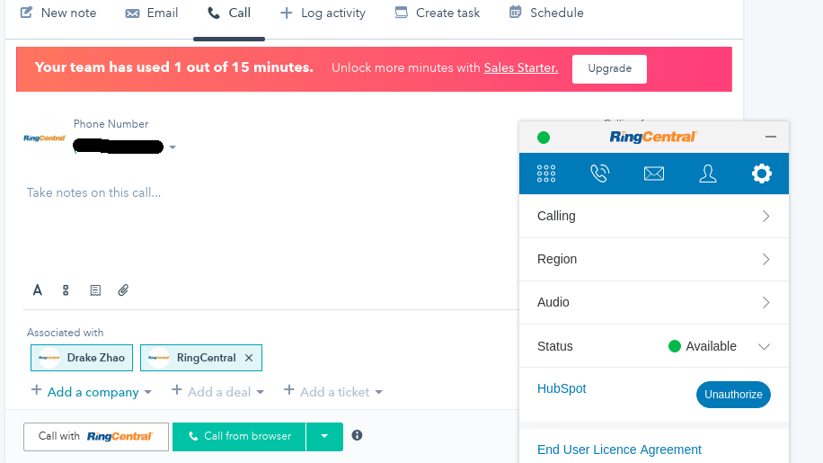
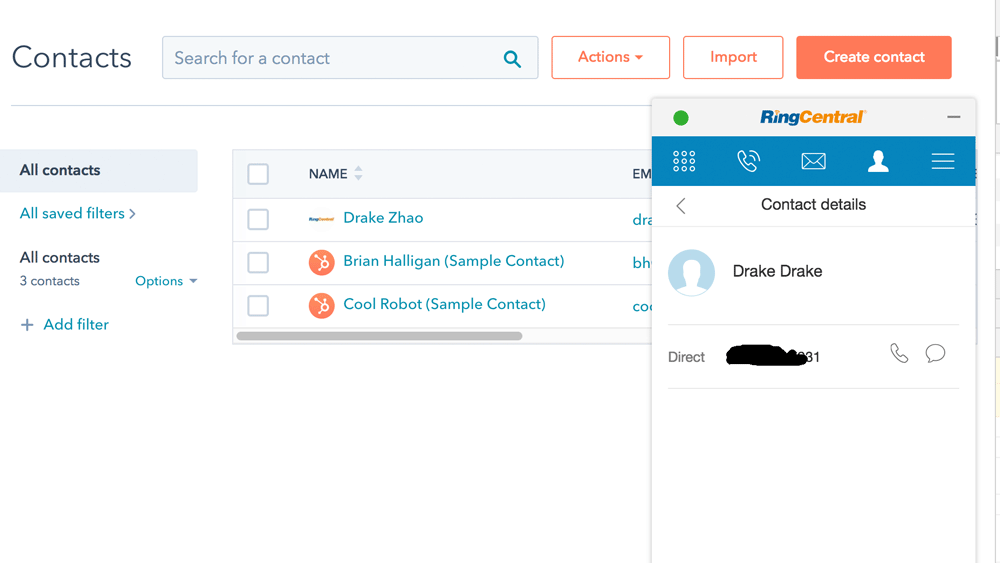
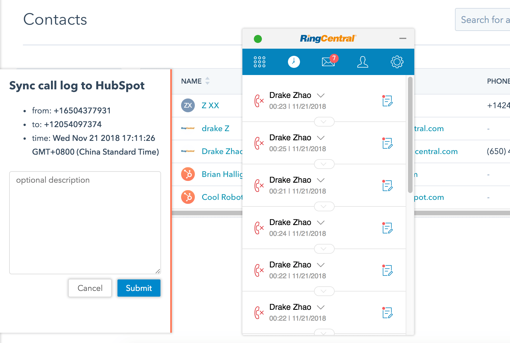
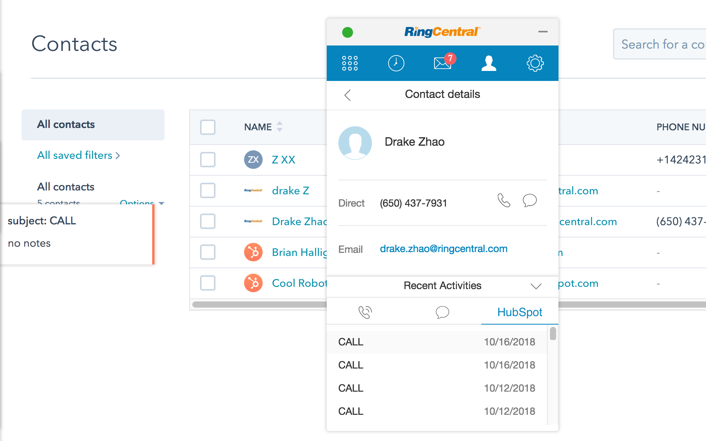

no_breadcrumb:true

# RingCentral Embeddable for HubSpot

The RingCentral Embeddable plugin for Firefox and Chrome greatly enhances HubSpot with a number of critical features that make using HubSpot as a CRM tool easier. 

<iframe src="https://www.youtube.com/embed/4okL0AxL-dg?modestbranding=1&rel=0&theme=light" width="630" height="360" frameborder="0" allow="accelerometer; autoplay; encrypted-media; gyroscope; picture-in-picture" allowfullscreen></iframe>

## Features

- Dial any HubSpot contact instantly with the click of a button
- Sync your RingCentral and HubSpot contacts
- Be notified of inbound calls via a HubSpot alert
- Display detailed information about inbound callers
- Easily attach call notes to your HubSpot contact activity log

<a class="btn btn-primary" href="install/">Install Now &raquo;</a>

## Screenshots

  <ol class="carousel-indicators">
    <li data-target="#carouselExampleIndicators" data-slide-to="0" class="active"></li>
    <li data-target="#carouselExampleIndicators" data-slide-to="1"></li>
    <li data-target="#carouselExampleIndicators" data-slide-to="2"></li>
  </ol>
  

    

      
    

    

      
    

    

      
    

    

      
    

    

      
    

    

      
    

    

      
    

    

      
    

    

      
    

    

      
    

  

  <a class="carousel-control-prev" href="#carouselExampleIndicators" role="button" data-slide="prev">
    
    Previous
  </a>
  <a class="carousel-control-next" href="#carouselExampleIndicators" role="button" data-slide="next">
    
    Next
  </a>

<a class="btn btn-primary" href="install/">Install Now &raquo;</a>